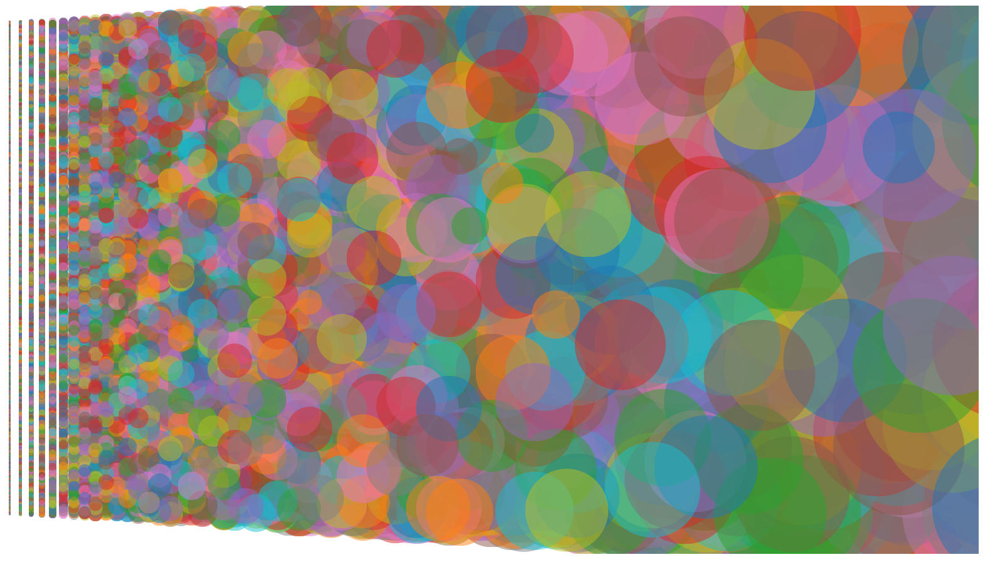
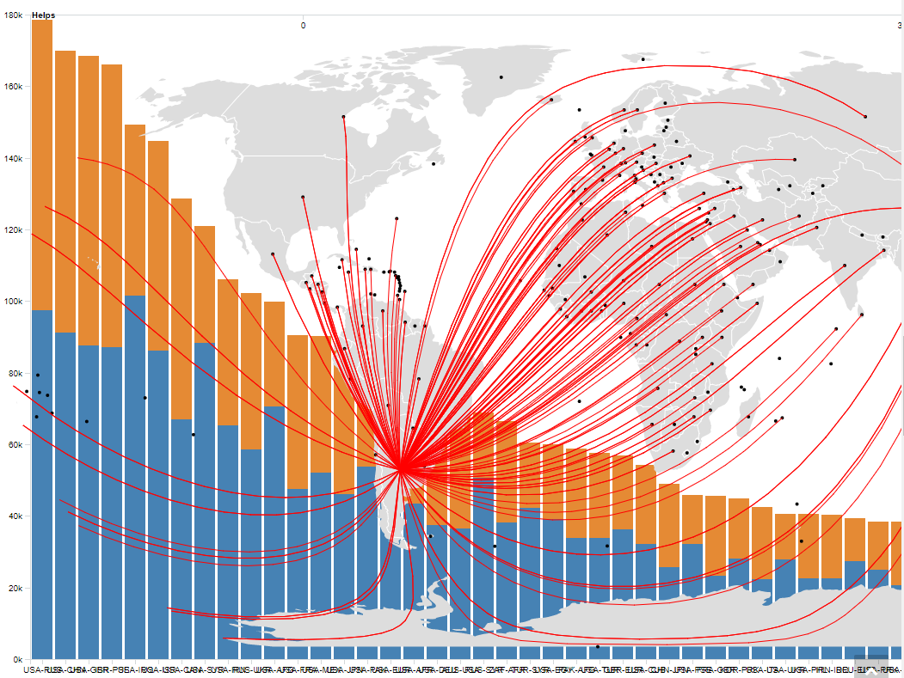
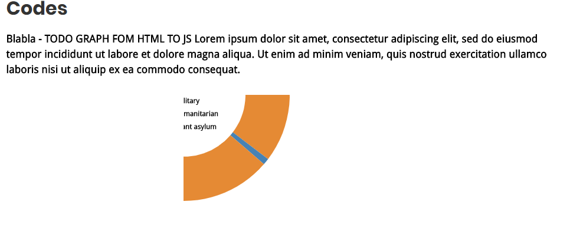

# Digital StoryTWEBing

__Start__ 

Go here -> https://luanamartelli.github.io/Digital_StoryTWEBing/

You will get a nice story about help between countries

__Caution__

If you want to fork/clone this repo, have a coffee first, you have 500MB data to download

Cheers :) 

__Blooper__

Why CSS and D3 are awesome...
Here are some of our trials during this project...

When we tried to put all data in the same chart

When we understood that CSS is not for everyone

Basically, same as 2